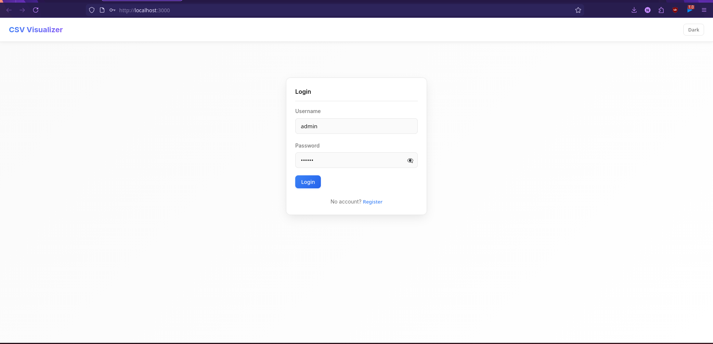
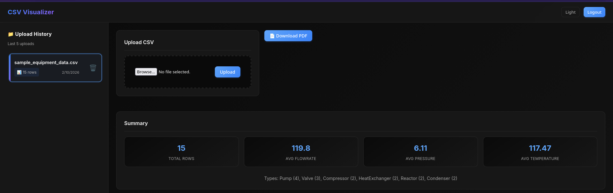
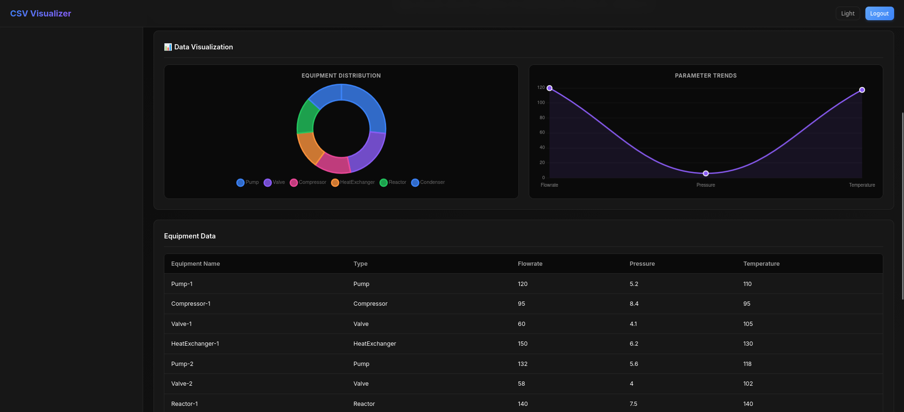
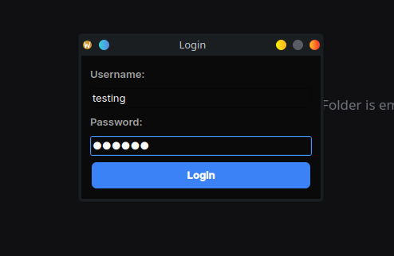
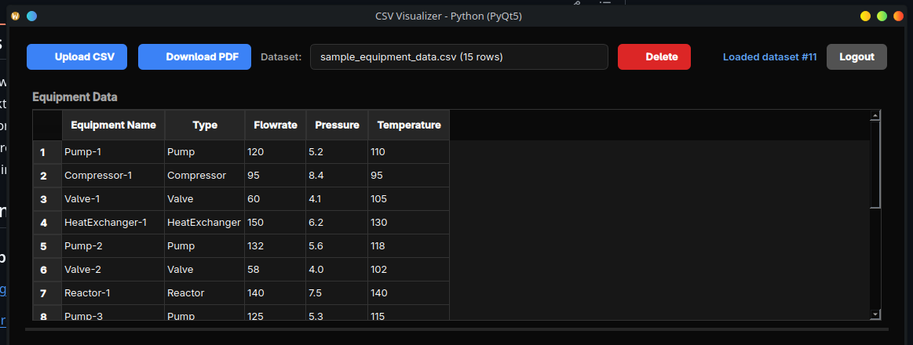
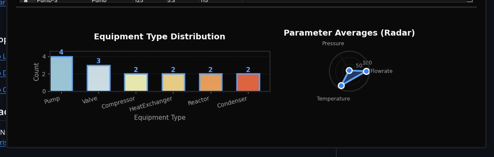

# CSV Visualizer

A hybrid **Web + Desktop** application for uploading, analyzing, and visualizing equipment data from CSV files.

## Features

- **CSV Upload**: Upload equipment data via file picker (Web) or file dialog (Desktop)
- **Data Analysis**: Automatic calculation of averages and type distribution
- **Interactive Charts**: Bar charts, radar charts for equipment parameters
- **PDF Reports**: Generate downloadable PDF reports with complete analysis
- **History Management**: Stores last 5 uploaded datasets per user
- **Authentication**: Secure user registration and login
- **Dark Mode**: Toggle between light and dark themes (Web)

## Tech Stack

| Layer | Technology |
|-------|------------|
| Backend | Django + Django REST Framework |
| Web Frontend | React.js + Chart.js |
| Desktop Frontend | PyQt5 + Matplotlib |
| Database | SQLite |
| Data Processing | Pandas |
| PDF Generation | ReportLab |

## Project Structure

```
FOSSEE-Csv-Analyzer/
├── backend/                 # Django REST API
│   ├── visualizer_api/     # Django settings, urls, wsgi
│   ├── app_core/           # Main app (models, views, utils)
│   ├── requirements.txt
│   └── Procfile
├── web_client/             # React application
│   ├── src/
│   │   ├── components/    # React components
│   │   └── styles/        # CSS styles
│   └── package.json
├── desktop_client/         # PyQt5 application
│   ├── app.py             # Entry point
│   └── components/        # UI components
├── sample_equipment_data.csv
└── README.md
```

## How to Run Locally

### Prerequisites

- Python 3.9+
- Node.js 18+
- pip
- npm

### 1. Backend Setup

```bash
cd backend

# Create virtual environment (optional but recommended)
python -m venv venv
source venv/bin/activate  # Linux/Mac
# or: venv\Scripts\activate  # Windows

# Install dependencies
pip install -r requirements.txt

# Run migrations
python manage.py migrate

# Create superuser (optional, for admin access)
python manage.py createsuperuser

# Start the server
python manage.py runserver
```

The API will be available at `http://127.0.0.1:8000/api/`

### 2. Web Frontend Setup

```bash
cd web_client

# Install dependencies
npm install

# Start development server
npm start
```

The web app will be available at `http://localhost:3000`

### 3. Desktop Frontend Setup

```bash
cd desktop_client

# Install dependencies
pip install PyQt5 matplotlib requests

# Run the application
python app.py
```

## API Endpoints

| Endpoint | Method | Description |
|----------|--------|-------------|
| `/api/auth/register/` | POST | User registration |
| `/api/auth/token/` | POST | User login (get token) |
| `/api/upload/` | POST | Upload CSV file |
| `/api/history/` | GET | List datasets (last 5) |
| `/api/summary/?id=` | GET | Get summary statistics |
| `/api/chart-data/?id=` | GET | Get chart-ready data |
| `/api/report/?id=` | GET | Download PDF report |

## CSV Format

The CSV file must include these columns:

```csv
Equipment Name,Type,Flowrate,Pressure,Temperature
Pump-001,Pump,150.5,25.3,45.2
Reactor-001,Reactor,0,15.8,180.5
```

A sample file (`sample_equipment_data.csv`) is included for testing.

## Screenshots

### Web Application








### Desktop Application







## Contact

**Developer**: Nrishan Jyoti Das

**Email**: nrishan@proton.me

---

**Thank you for reviewing this submission!**
